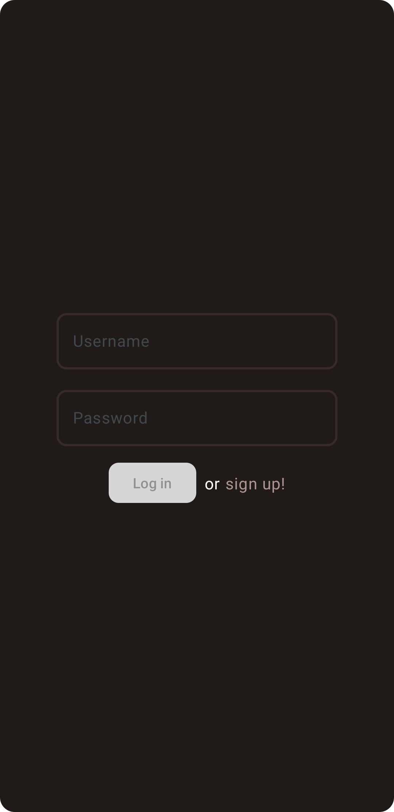
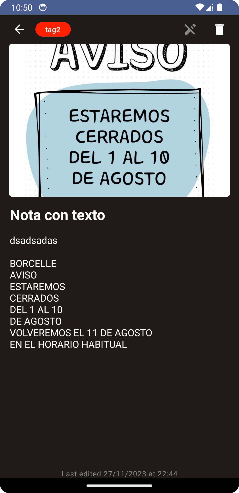
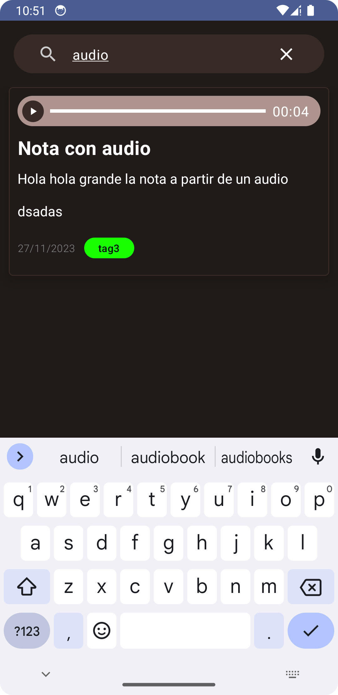
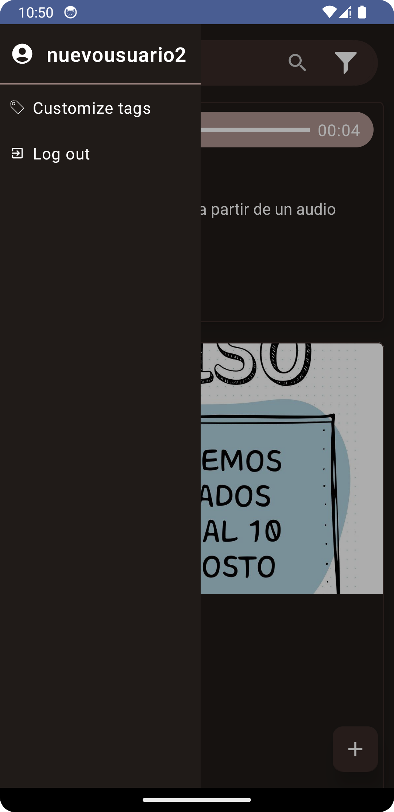
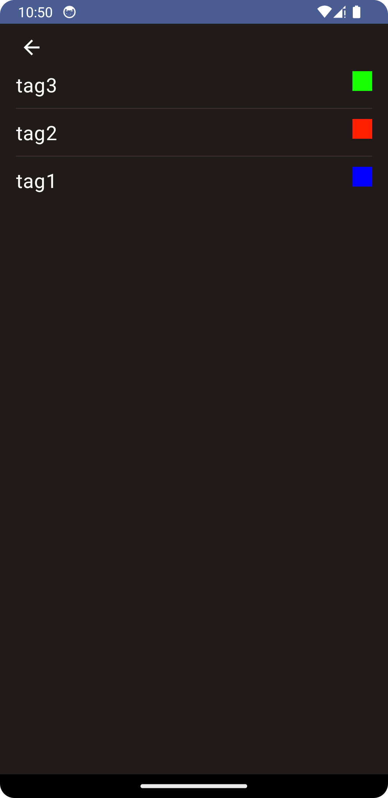

# Capture

App de notas con algunas vueltas de tuerca para simplificarle la vida a los usuarios.

### Funcionalidades

- Crear notas de la forma clasica, escribiendo
- Crear notas a partir del texto de una imagen
- Crear notas mediante speech-to-text
- Agregar tags personalizables a las notas
- Filtrar por titulo de notas y tags
- Visor de Markdown incorporado para poder hacer uso de todos los beneficios de dicho formato

## Como levantar la app

### Para levantar la aplicacion

Tan solo abrir la carpeta `DADMApp` con Android Studio y correr

### Para levantar el backend

- Requiere tener instalado `NodeJS 18.17.0` y `yarn@v1` (aunque si usan npm tambien deberia funcionar)

Moverse dentro de la carpeta `backend` y correr los siguientes comandos:

```bash
# o el comando 'npm install' si se usa npm
$ yarn

# o 'npm run start' si se usa npm
$ yarn start
```

Con todo esto corriendo ya deberian poder registrarse y comenzar a utilizar la app normalmente

## Screenshots


<div style="display: flex; flex-wrap: wrap; justify-content: space-around;">
  
  
  
  
  
</div>
